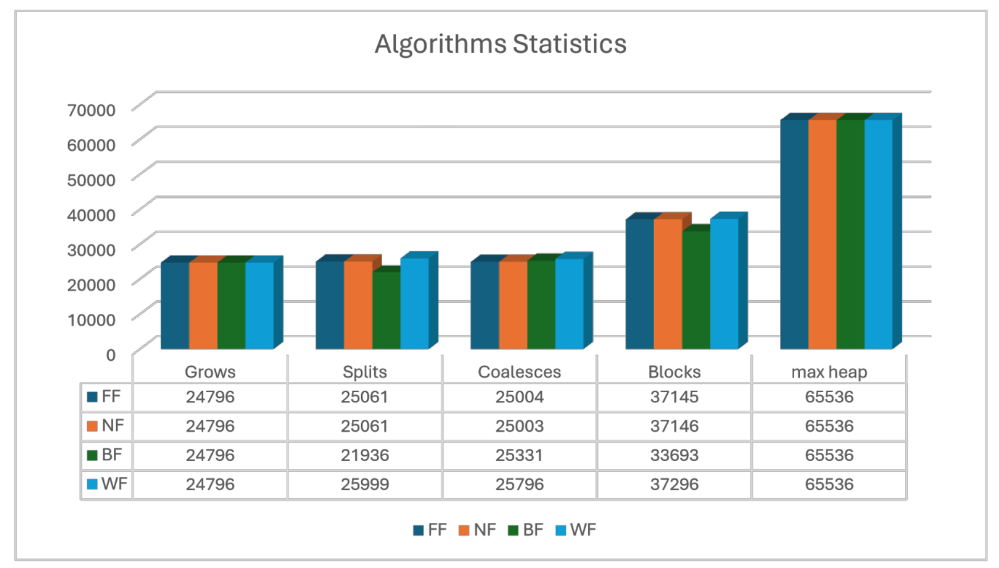

# Custom Malloc Implementation in C

## Overview

This project is a custom memory management library written in C that replicates the behavior of `malloc()` and `free()` by interacting directly with the operating system to manage heap allocation. It supports multiple allocation strategies and simulates how a user-level allocator works under the hood.

## Features

- Implements four heap allocation strategies:
  - **First-Fit**
  - **Next-Fit**
  - **Best-Fit**
  - **Worst-Fit**
- Supports block splitting and memory coalescing to reduce fragmentation
- Tracks and prints runtime statistics for each strategy
- Includes benchmarking tests to compare with standard `malloc()`

### Build the project:
```bash
bash run.sh
```

## Benchmarking
The 4 heap allocation strategies mentioned above were benchmarked against the system `malloc`, the findings are based the average of 20 trials.

### Runtime Comparison
![Execution Time] (images/runtime_chart.png)

### Heap Management Statistics 


>For a more in-depth analysis, see the full [report.pdf)(./Report.pdf).

The test results show:
- **Next Fit** had the best runtime performance.
- **Best Fit** managed heap fragmentation more efficiently.
- **Worst Fit** performed the worst in both metrics.
- **System Malloc** outperformed all custom implementations by a wide margin, as expected.

